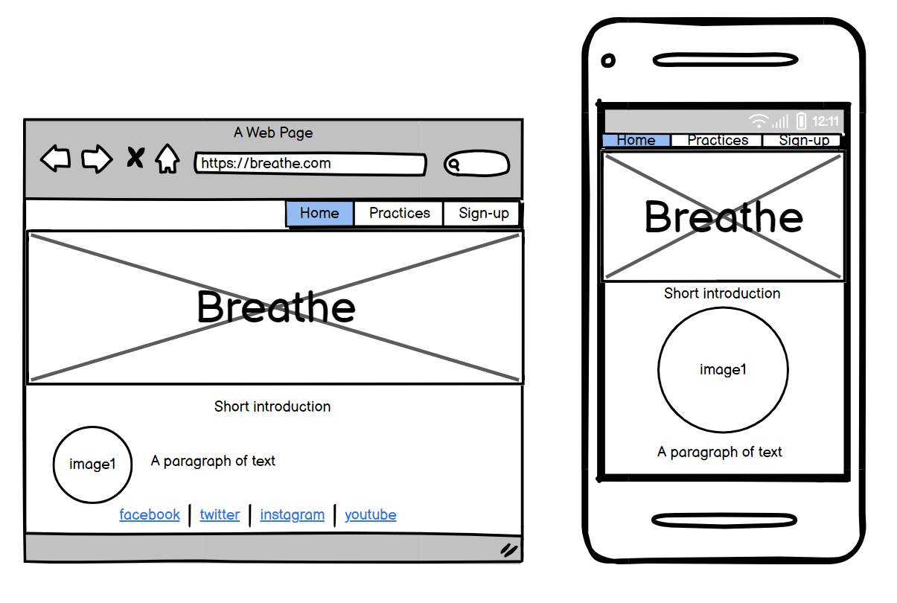
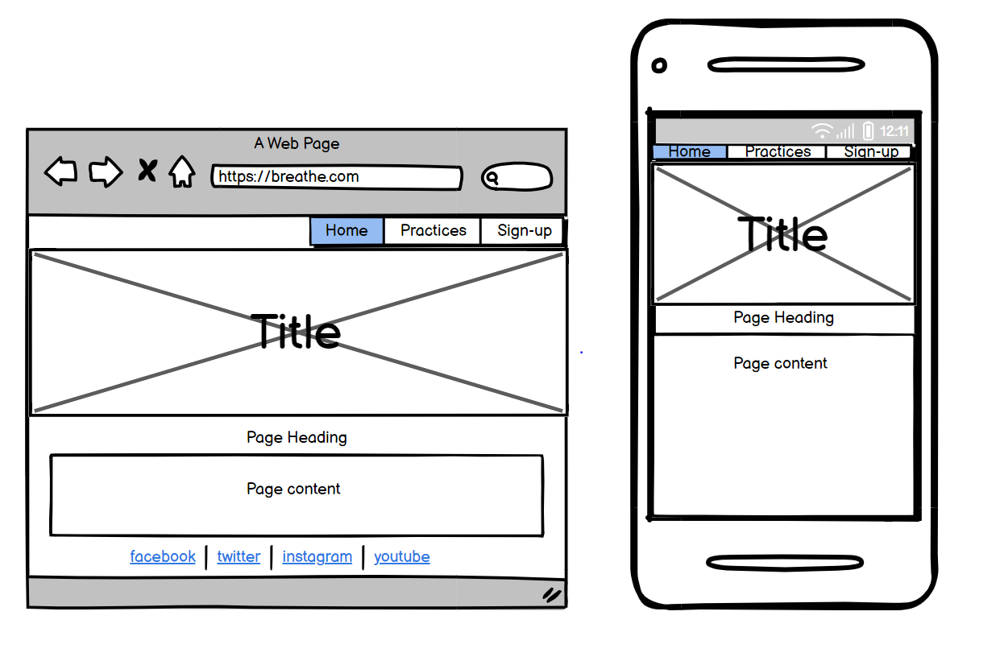
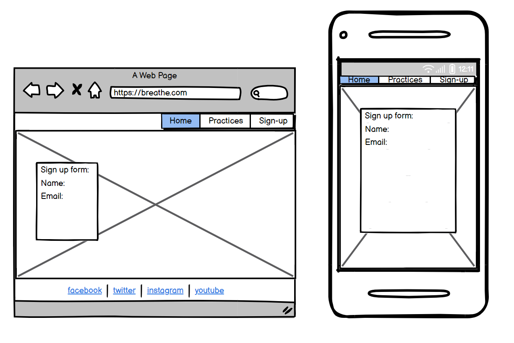
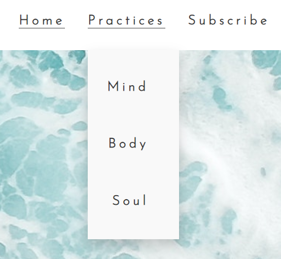
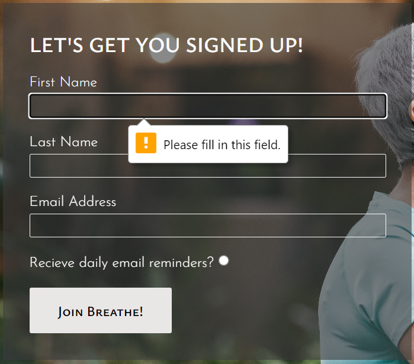

# PORTFOLIO 1 - "Breathe"

Breathe is a site providing insights and guidence on how to improve your mental well-being. It offers three pages of information with walk-throughs of various meditative techniques, a video link to a yoga tutorial, and a recipe to feed the soul.

The site has a large target audience as good mental well-being should be for everyone, as such the site is simple and easy to use making it accessible for all.

Below you can see the site on different screen sizes.

The live site can be found [here]()

---

## CONTENTS

- [PORTFOLIO 1 - "Breathe"](#portfolio-1---breathe)
  - [CONTENTS](#contents)
  - [User Experience (UX)](#user-experience-ux)
    - [User Stories](#user-stories)
      - [First Time Visitor Goals](#first-time-visitor-goals)
  - [Design](#design)
    - [Colour Scheme](#colour-scheme)
    - [Typography](#typography)
    - [Imagery](#imagery)
    - [Wireframes](#wireframes)
  - [Features](#features)
    - [General features on each page](#general-features-on-each-page)
    - [Future Implementations](#future-implementations)
    - [Accessibility](#accessibility)
  - [Technologies Used](#technologies-used)
    - [Languages Used](#languages-used)
    - [Frameworks, Libraries \& Programs Used](#frameworks-libraries--programs-used)
  - [Deployment \& Local Development](#deployment--local-development)
    - [Deployment](#deployment)
    - [Local Development](#local-development)
      - [How to Fork](#how-to-fork)
      - [How to Clone](#how-to-clone)
  - [Testing](#testing)
  - [Credits](#credits)
    - [Code Used](#code-used)
    - [Content](#content)
    - [ Media](#media)
    - [ Acknowledgments](#acknowledgments)

---

## User Experience (UX)

### User Stories

#### First Time Visitor Goals

- To quickly find information about meditative techniques that can improve mental well-being
- To be encouraged to focus more on personal well-being by learning how simple it is to encorporate into everyday life
- To be able to easily navigate between pages display different well-being techniques

## Design

### Colour Scheme

We wanted to have a colour scheme that was not too bright and that had a calming feel upon visiting the site. So we chose pale blues, and plain black and white for accessibility and to reduce cognitive overload.

### Typography

Google Fonts was used to import the chosen fonts for this site.

We chose Josefin sans for main headings and Ysabeau SC for everything else. We felt these were complimentary fonts, easy to read and in keeping with the peaceful vibe we wanted the website to have.

### Imagery

All imagery used showed peaceful environments, mostly of nature (ocean, forest scenes) to give the sense of tranquility. Pictures of people in a meditative state were also used ensuring people of a variety of demographics were represented so all users would feel at home on our website.

### Wireframes

## Features

The website comprised of 5 pages, the index page, 3 informative pages, and a sign-up page.

### General features on each page

All pages are divided into 4 main sections, the navigation section, a banner displaying an image and the main heading, the information section (which is then divided further depending on the page), and the footer containing links to all social media pages. This remained consistant throughout the site for easy access and user experience. Across all pages it was ensured the banner did not occupy the entire length of the screen to encourage users to scroll down to read more.

A drop-down 'practices' tab was used in the navigation header which then displayed the 3 practices pages. This was chosen to reduce cognitive overload reducing the number of visible navigation tabs to the user.

The index page is designed to draw users in by highlighting the need for the resources provided on the site and summarising the information available.

The practices pages make use of engaging imagery, videos, and audio files to break up the text so it is less overwhelming for users and more visually stimulating.

The sign-up page follows conventions users will be familiar with, and makes use of hover features on text boxes for easy navigation, with pop-up messages when a section needs to be filled.

### Future Implementations

In future I would like to create a login option in order to create a user network so users can encourage eachother on their journey in improved mental well-being.

### Accessibility

We have actively tried to ensure our website is accessible friendly as possible, we achieved this by:
- Using semantic HTML
- Ensuring sufficient colour contrast throughout the site and using easily readable fonts
- Providing information for screen readers where icons were used in place of text, for example for our social media icons in the footer

## Technologies Used

### Languages Used

HTML, CSS

### Frameworks, Libraries & Programs Used

Balsamiq - for wireframes
Git - for version control
Github - to save and store files 
Google Fonts - to import all fonts
Font Awesome - for the iconography
Google Dev Tools - to troubleshoot and test features
Pexels - to download copyright free images

## Deployment & Local Development

### Deployment

The site is deployed using GitHub Pages. Visit the deployed site here. To deploy using GitHub pages:

Login or Sign Up to GitHub.
Open the project repository.
Click on "Settings" on the navigation bar under the repository title.
Click on "Pages" in the left hand navigation panel.
Under "Source", choose which branch to deploy. This should be Main for newer repositories (older repositories may still use Master).
Choose which folder to deploy from, usually "/root".
Click "Save", then wait for it to be deployed. It can take some time for the page to be fully deployed.
Your URL will be displayed above "Source".

### Local Development

#### How to Fork

To fork the repository:
- Log in to Github
- Go to the repository for this project 
- Click the Fork button in the top right corner

#### How to Clone

To clone the repository:
- Log in to GitHub
- Go to the repository for this project
- Click on the code button, select whether you would like to clone with HTTPS, SSH or GitHub CLI and copy the link shown.
- Open the terminal in your code editor and change the current working directory to the location you want to use for the cloned directory.
- Type 'git clone' into the terminal and then paste the link you copied in step 3. Press enter.

## Testing

Testing documentation can be found [here](TESTING.md)

## Credits

### Code Used

The code was written by myself with some parts being taken from the Love Running project - for example the footer and the sign-up page.

### Content

The content for the site was created by myself, with the yoga video being embedded from Youtube, and through carrying out research into mindfulness techniques.

###  Media

- <a href="https://www.pexels.com/photo/sea-water-forming-seafoams-4321194/">Index page cover image</a>
- <a href="https://www.pexels.com/photo/woman-meditating-in-the-outdoors-2908175/">Index page first circle image</a>
- <a href="https://www.pexels.com/photo/close-up-photo-of-yes-you-can-text-on-white-surface-7508024/">Index page second circle image</a>
- <a href="https://www.pexels.com/photo/woman-practicing-yoga-3822906/">Index page third circle image</a>
- <a>Mind page cover image</a>
- <a href="https://www.pexels.com/photo/person-holding-black-pen-sketching-flower-820673/">Mind page doodling image</a>
- <a href="https://www.pexels.com/photo/a-woman-sitting-on-a-rock-4909325/">Mind page meditation image</a>
- <a href="https://www.pexels.com/photo/crop-unrecognizable-person-in-sandals-walking-on-asphalt-sidewalk-5967867/">Mind page walk image</a>
- <a href="https://www.pexels.com/photo/women-in-activewear-doing-yoga-3822672/">Body page cover image</a>
- <a href="https://www.youtube.com/watch?v=j7rKKpwdXNE&ab_channel=YogaWithAdriene">Body page yoga video</a>
- <a href="https://www.pexels.com/photo/fresh-lemons-and-mint-sprigs-above-zero-waste-bag-7195133/">Soul page cover image</a>
- <a href="https://www.pexels.com/photo/clear-glass-bottle-filled-with-broccoli-shake-1346347/">Soul page smoothie image</a>
- <a href="https://www.pexels.com/photo/woman-practicing-yoga-6787218/">Sign-up page cover image</a>
  
###  Acknowledgments

Thanks to the tutors at Code Institute for always being on hand when I needed some help with my code, and to my mentor for their guidence and advice.
