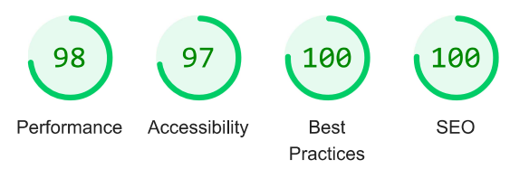
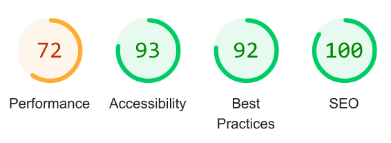
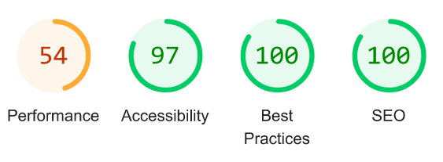
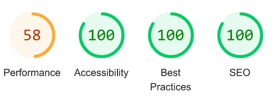

# BREATHE -  Testing

Visit the deployed site: [Breathe](https://kera-cudmore.github.io/TheQuizArms/)

- - -

## CONTENTS

- [BREATHE -  Testing](#breathe----testing)
  - [CONTENTS](#contents)
  - [AUTOMATED TESTING](#automated-testing)
    - [W3C Validator](#w3c-validator)
    - [Lighthouse](#lighthouse)
    - [Results](#results)
  - [MANUAL TESTING](#manual-testing)
    - [Testing User Stories](#testing-user-stories)
    - [Full Testing](#full-testing)
  - [BUGS](#bugs)
    - [Known Bugs](#known-bugs)
    - [Solved Bugs](#solved-bugs)

Testing was ongoing throughout the entire process. Chrome developer tools was used whilst building to find and troubleshoot any issues.

I have analysed each page using google chrome developer tools to ensure the responsiveness of all pages on different screen sizes.

- - -

## AUTOMATED TESTING

### W3C Validator

[W3C](https://validator.w3.org/) was used to validate the HTML on all pages of the website. It was also used to validate the CSS.

* [index.html](testing/w3/w3-index.png) - Passed, no errors or warnings to show.
* [mind.html](testing/w3/w3-game.png) - Passed, no errors or warnings to show.
* [body.html](testing/w3/w3-highscores.png) - Passed, no errors or warnings to show.
* [soul.html](testing/w3/w3-404.png) - Passed, no errors or warnings to show.
* [subscribe].html](testing/w3/w3-500.png) - Passed, no errors or warnings to show.

* [style.css](testing/w3/w3-css.png) - Passed, no errors or warnings to show.

### Lighthouse

I used Lighthouse within the Chrome Developer Tools to test the performance, accessibility, best practices and SEO of the website.

### Results

All pages achieved 100 for SEO, a minimum of 92 for best practices, and 93 for accessibility. The scores for performance however were quite low, this was due to the image formats I used. This will effect the load time of the site, in future I will use alternative formatting for my images to ensure better performance.

## MANUAL TESTING

### Testing User Stories

`First Time Visitors`

| Goals | How are they achieved? |
| :--- | :--- |
| I want to work on my mental well-being finding tools and techniques that suit my lifestlye. | Breathe offers a variety of techniques and tools that can be easily incorporated into day-to-day life. |
| I want the site to be responsive to my device. | I have developed the site with responsiveness in mind. |
| I want the site to be easy to navigate. | Clear headings are used in the navigation bar at the top of the screen these are clear and easy to use on all devices.  |

`Returning Visitors`

|  Goals | How are they achieved? |
| :--- | :--- |
| I want to be able to track my progress. | Going forward I would like to add an interactive tracking tab that monitors users activities and their progress. |

`Frequent Visitors`

| Goals | How are they achieved? |
| :--- | :--- |
| I want to be able to engage with a community also working on their mental wellbeing | I would like to add a login community element so users can meet like minded people and encourage them on their journeys.

### Full Testing

Full testing was performed on the following devices:

* Laptop:
  * Microsoft surface laptop
* Mobile Devices:
  * iPhone 13 mini

Each device tested the site using the following browsers:

* Google Chrome
* Safari

| Feature | Expected Outcome | Testing Performed | Result | Pass/Fail |
| --- | --- | --- | --- | --- |
| `Navbar` |
|  |  |  |  |  |
| Home Page Link | When clicked the user will be redirected to the home page.| Clicked link | Redirected to the home page. | Pass |
| Practices Link | When hovered over a drop-down menu appears. | Hovered | Menu appears. | Pass |
| Mind Link | When clicked the user will be redirected to the mind page. | Clicked link | Redirected to the mind page | Pass |
| Body Link | When clicked the user will be redirected to the body page. | Clicked link | Redirected to the body page | Pass |
| Soul Link | When clicked the user will be redirected to the soul page. | Clicked link | Redirected to the soul page | Pass |
| Subscribe Link | When clicked the user will be redirected to the subscribe page. | Clicked link | Redirected to the subscribe page | Pass |
| `Footer` |
|  |  |  |  |  |
| Social media links | When clicked the user will be redirected to relevent social media page. | Clicked all logos | Redirected to the correct pages. | Pass |
| `Subscribe Page` |
| | | | | | |
| First and last name input - empty | The username is a required field, so should not submit with no value | Tried to submit form with no value entered | Tooltip lets user know this value is required | Pass |
| Email input | The email input should include an email address  | Entered plain text | Tooltip tells user to use an email address here | Pass |
| Email input - empty | The email is a required field, so should not submit with no value | Tried to submit form with no value entered | Tooltip lets user know this value is required | Pass |
| Join button | Should redirect user to the home page | Created new user and submitted form | Redirected to the home page | Pass |

 - - -

## BUGS

### Known Bugs

No known bugs.

### Solved Bugs

No known bugs.
