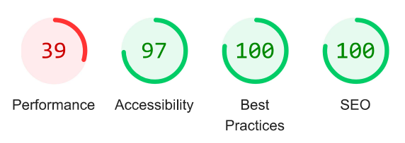

# BREATHE -  Testing

Visit the deployed site: [Breathe](https://kera-cudmore.github.io/TheQuizArms/)

- - -

## CONTENTS

- [BREATHE -  Testing](#breathe----testing)
  - [CONTENTS](#contents)
  - [AUTOMATED TESTING](#automated-testing)
    - [W3C Validator](#w3c-validator)
    - [Lighthouse](#lighthouse)
    - [Results](#results)
  - [MANUAL TESTING](#manual-testing)
    - [Testing User Stories](#testing-user-stories)

Testing was ongoing throughout the entire process. Chrome developer tools was used whilst building to find and troubleshoot any issues.

I have analysed each page using google chrome developer tools to ensure the responsiveness of all pages on different screen sizes.

- - -

## AUTOMATED TESTING

### W3C Validator

[W3C](https://validator.w3.org/) was used to validate the HTML on all pages of the website. It was also used to validate the CSS.

* [index.html](testing/w3/w3-index.png) - Passed, no errors or warnings to show.
* [mind.html](testing/w3/w3-game.png) - Passed, no errors or warnings to show.
* [body.html](testing/w3/w3-highscores.png) - Passed, no errors or warnings to show.
* [soul.html](testing/w3/w3-404.png) - Passed, no errors or warnings to show.
* [subscribe].html](testing/w3/w3-500.png) - Passed, no errors or warnings to show.

* [style.css](testing/w3/w3-css.png) - Passed, no errors or warnings to show.

### Lighthouse

I used Lighthouse within the Chrome Developer Tools to test the performance, accessibility, best practices and SEO of the website.

### Results

All pages achieved 100 for SEO, a minimum of 92 for best practices, and 93 for accessibility. The scores for performance however were quite low, this was due to the image formats I used. This will effect the load time of the site, in future I will use alternative formatting for my images to ensure better performance.

## MANUAL TESTING

### Testing User Stories

`First Time Visitors`

| Goals | How are they achieved? |
| :--- | :--- |
| I want to work on my mental well-being finding tools and techniques that suit my lifestlye. | Breathe offers a variety of techniques and tools that can be easily incorporated into day-to-day life. |
| I want the site to be responsive to my device. | I have developed the site with responsiveness in mind. |
| I want the site to be easy to navigate. | Clear headings are used in the navigation bar at the top of the screen these are clear and easy to use on all devices.  |

`Returning Visitors`

|  Goals | How are they achieved? |
| :--- | :--- |
| I want to be able to choose a level of difficulty that I feel is appropriate for me, based on my experience from my first visit to the site. | Users are able to select their own level of difficulty before the game begins. Once they have played they are free to select a different level of difficulty for subsequent games. |

`Frequent Visitors`

| Goals | How are they achieved? |
| :--- | :--- |
| I want to be able to adjust the difficulty level to keep improving my knowledge. | Users are able to select their own level of difficulty before the game begins. Once they have played they are free to select a different level of difficulty for subsequent games. |
| I want to be able to log my high scores to see how I am performing. | Users of the site are able to log their high scores to the high scores page. The top ten results will be displayed. |

